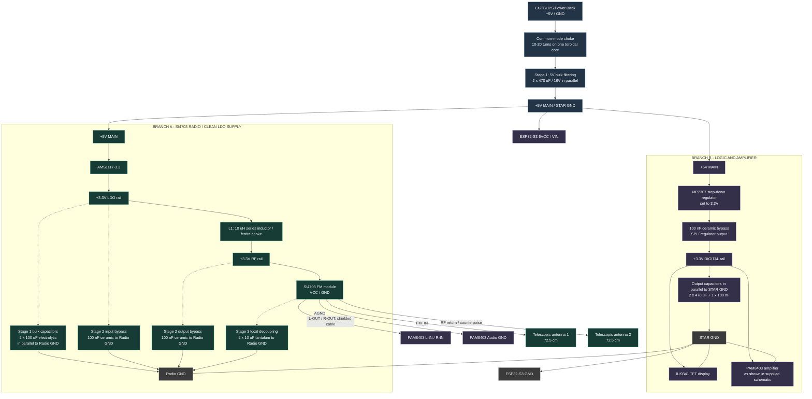

# FM Radio Power and EMI Schematic

This Mermaid diagram redraws the supplied power schematic in a responsive format for GitHub. It keeps the original two supply branches and component values.

## Notes

- Capacitors shown as bypass, bulk, or local decoupling are connected in parallel between their supply node and the indicated ground. They are not in series with the supply rail.
- L1 is in series with the positive SI4703 supply rail; do not put an inductor in the ground return.
- The supplied schematic shows PAM8403. It is not installed in the current radio build, which uses external powered speakers.
- Keep the MP2307 switching regulator and its inductor physically separated from the SI4703 module and antenna.
- Confirm regulator polarity, capacitor polarity, and the voltage requirements of each breakout before powering the circuit.
